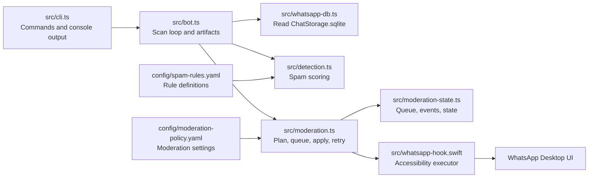

# Architecture

WhatsCove is a desktop-side moderation system. It observes WhatsApp Desktop through the local database and performs moderation through the live desktop UI when configured to do so.

## System Diagram

## Runtime Flow

1. `src/cli.ts` parses command-line flags and loads rule and moderation config.
2. `src/bot.ts` asks `src/whatsapp-db.ts` for recent inbound WhatsApp rows.
3. `src/whatsapp-db.ts` reads WhatsApp Desktop's local `ChatStorage.sqlite`.
4. `src/bot.ts` creates message candidates and calls `src/detection.ts`.
5. `src/detection.ts` scores candidates against all active spam rules.
6. Fresh strong matches are logged and passed into `src/moderation.ts`.
7. `src/moderation.ts` creates `ModerationDecision` records based on policy.
8. In `detect` mode, decisions are recorded only.
9. In `queue` mode, decisions are appended to `data/moderation-queue.jsonl`.
10. In `apply` mode, decisions are sent to a moderation hook.
11. If no custom hook is configured, the bundled Swift hook drives WhatsApp Desktop.
12. Hook trace output is captured and written into `data/moderation-events.jsonl`.

## Boundaries

The TypeScript code owns durable state and policy. The Swift code owns ephemeral interaction with the WhatsApp UI.

The database read path is one-way. WhatsCove reads WhatsApp's SQLite database but never writes to it. All destructive moderation actions go through the same visible WhatsApp Desktop UI a human moderator would use.

The bundled Swift hook is intentionally not a general WhatsApp automation framework. It supports the specific moderation actions in `ModerationActionType` and logs aggressively because WhatsApp Desktop's accessibility tree can change.

## Important Types

`MessageRow` is a normalized row from WhatsApp's database. It includes the local message primary key, timestamp, chat identity, sender identity, admin flag, body text, and rich preview fields.

`SuspiciousMatch` is the detector's output. It includes the matched candidate text, rule, score, explanations, sender identity, message timestamp, and fingerprint.

`ModerationDecision` is one unit of moderation work. It includes the action, target chat, target sender, target message, state, error, UI trace, and screenshot settings.

`ModerationState` is compact state used to avoid repeating completed decisions and to track local-only bans if that feature is enabled.

## Data Files

Runtime data lives under `data/`.

- `latest-suspects.json`: Latest scan snapshot and matches.
- `spam-alerts.jsonl`: Machine-readable spam match log.
- `spam-alerts.log`: Human-readable spam summaries.
- `moderation-queue.jsonl`: Queued moderation decisions.
- `moderation-events.jsonl`: Append-only moderation audit log.
- `moderation-state.json`: Compact processed decision state.
- `moderation-screenshots/`: Optional before/after screenshots around consequential UI actions.

Screenshots are ignored by git because they can contain private WhatsApp content.

## Configuration Files

`config/spam-rules.yaml` defines spam families and scoring signals.

`config/moderation-policy.yaml` defines whether moderation is enabled, which mode to use, what actions to take, whether to skip admins, whether to retry failed actions, and whether to capture screenshots.

YAML is preferred automatically when both YAML and JSON versions of a config exist.

## Freshness And Identity

`lastSeenMessagePk` is the watch loop cursor. It controls which database rows are fetched after each poll.

`seenFingerprints` is in-memory duplicate suppression for the current process. It prevents repeated logging and moderation for the same match during one watcher run.

`ModerationDecision.id` is a stable action id derived from the match fingerprint plus the action type.

The match fingerprint includes `messagePk` and `messageTimeLocal`, so two identical spam texts from different message rows are treated as distinct events.

## Failure Philosophy

Detection should fail closed into "no match" or "weak match". Moderation should fail loudly with enough trace detail and screenshots for a human to reconstruct what happened.

For destructive actions, the code should prefer a clear failure over accidentally performing a local-only delete, removing the wrong member, or acting on the wrong app's context menu.
